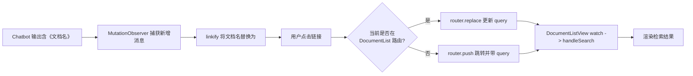

### Chatbot 对话内容优化方案

> 目标：让聊天回复中的 **文档名称** 可点击，跳转（或同页刷新）到系统文档管理列表，并自动执行名称检索。

---

## 1. 背景与痛点

- **痛点 1**：LLM 总结回复只给出纯文本，用户需手动复制文档名再到系统检索，体验割裂。
- **痛点 2**：若点击后新开窗口 / 分页，用户返回聊天不便、窗口切换成本高。

> 解决思路：前端在渲染阶段把文档名替换为链接；点击后利用前端 Router 在同一窗口完成跳转或刷新查询。

---

## 2. LLM 输出格式约定

在 Prompt 中要求：

```
当提到文档时，请使用全角书名号包裹：
  例如：我找到了《合同管理制度》与《招标文件模板》。
```

- 也可改为自定义占位符 `[[DOC:合同管理制度]]`，只需调整下文正则。

---

## 3. 代码改动概览

| 位置                               | 改动                                | 说明                                                 |
| ---------------------------------- | ----------------------------------- | ---------------------------------------------------- |
| **src/main.ts**                    | `window.__LDIMS_ROUTER__ = router;` | 将 Vue Router 暴露给全局脚本使用                     |
| **src/views/DocumentListView.vue** | `watch(route.query.docName, ...)`   | 侦听查询参数，赋值搜索框并 `handleSearch()`          |
| **index.html**                     | 注入 `linkify + click` 脚本         | 将《文档名》替换为 `<a>`；点击后调用 Router 同页导航 |

> 三处改动均为前端，无需后端支持。

---

## 4. main.ts 修改示例

```ts
// ... existing code ...
app.use(router).mount("#app");
// 暴露 Router，供 index.html 使用
(window as any).__LDIMS_ROUTER__ = router;
```

---

## 5. DocumentListView.vue 核心监听

```ts
import { useRoute, useRouter } from 'vue-router';

setup() {
  const route = useRoute();
  watch(
    () => route.query.docName,
    (val) => {
      if (val) {
        searchForm.docName = String(val);
        resetOtherFields(); // 如需
        handleSearch();
        // 清空 URL 查询防止刷新重复
        useRouter().replace({ query: {} });
      }
    },
    { immediate: true }
  );
}
```

---

## 6. index.html 注入脚本（完整版）

```html
<!-- Chatbot linkify & Same-Page Search -->
<script>
  const DOC_ROUTE_NAME = "DocumentList"; // Router 路由名称
  const docNameReg = /《([^》]{2,50})》/g; // 识别书名号中文档名

  // 将书名号包围的文档名替换为 <a>
  function linkify(node) {
    node.innerHTML = node.innerHTML.replace(
      docNameReg,
      (_, name) => `<a href="#" class="doc-link" data-doc="${name}">${name}</a>`
    );
  }

  // 统一事件代理：点击后同页检索
  function handleClick(e) {
    const a = e.target.closest(".doc-link");
    if (!a) return;
    e.preventDefault();

    const name = a.dataset.doc;
    const router = window.__LDIMS_ROUTER__;

    if (!router) {
      // 兜底：无 Router 时做整页跳转
      location.href = "/documents?docName=" + encodeURIComponent(name);
      return;
    }

    const current = router.currentRoute.value;
    if (current.name === DOC_ROUTE_NAME) {
      router.replace({ query: { docName: name } }); // 列表页内刷新查询
    } else {
      router.push({ name: DOC_ROUTE_NAME, query: { docName: name } }); // 导航 + 查询
    }
  }

  // 初始化：监听 Chatbot 气泡窗口 DOM
  function initObserver() {
    const bubble = document.getElementById("dify-chatbot-bubble-window");
    if (!bubble) return;

    bubble.addEventListener("click", handleClick, true);

    const mo = new MutationObserver((muts) => {
      muts.forEach((m) =>
        m.addedNodes.forEach((n) => {
          if (n.nodeType === 1) linkify(n);
        })
      );
    });
    mo.observe(bubble, { childList: true, subtree: true });
  }

  document.addEventListener("DOMContentLoaded", () => {
    const timer = setInterval(() => {
      if (document.getElementById("dify-chatbot-bubble-window")) {
        clearInterval(timer);
        initObserver();
      }
    }, 400);
  });
</script>
```

---

## 7. 整体流程图



---

## 8. 优势与注意事项

### 优势

- **零后端改动**：全部在前端完成。
- **同页体验**：无需新窗口或弹窗，保持上下文。
- **易回退**：移除脚本即可恢复原状。

### 注意

- 确保 LLM 始终输出可匹配模式（《》或占位符）。
- 替换正则需考虑文档名中的特殊字符，必要时转义。
- 若将 Router 挂到 `window` 有顾虑，可改为自定义全局对象或事件总线。

---

> 更新日期：2025-07-XX
